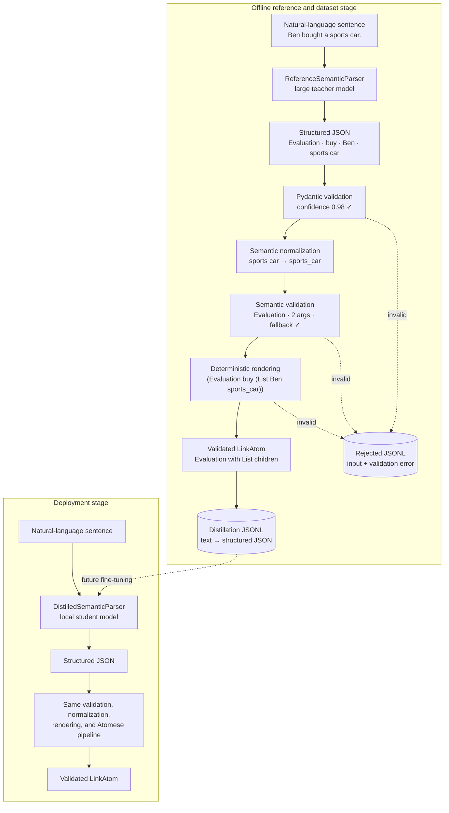
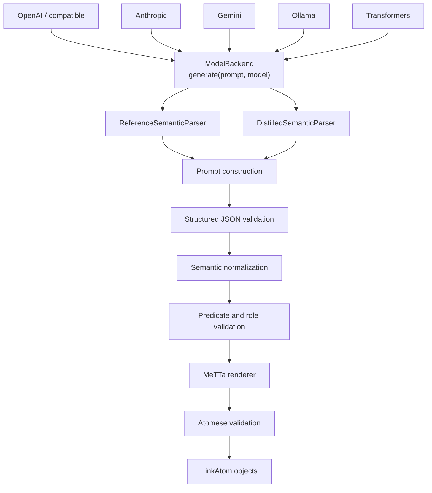

# Neuro-Symbolic LLM

Natural-language text to validated MeTTa Atomese, with configurable hosted and
local model backends. The current implementation includes the semantic-parser
foundation, Atomese grammar, offline dataset generation, and unit tests.

## Overview

```text
Input:  Ben bought a car.
Model target: {"assertions": [{"predicate": "Evaluation", "relation": "buy", ...}]}
Derived MeTTa: (Evaluation buy (List Ben car))
```


[`ReferenceSemanticParser`](./parser/semantic/semantic_parser.py) uses a larger model to make validated examples for
offline distillation. [`DistilledSemanticParser`](./parser/semantic/semantic_parser.py) uses the same validation path
with a future fine-tuned 1B–3B local model for deployment.

## Architecture

### End-to-end teacher–student flow



### Parser component relationships



### Component source map

GitHub renders Mermaid diagrams securely, so navigation is provided through
standard Markdown links:

| Diagram component | Implementation |
| --- | --- |
| Model backends and `ModelBackend` | [`backends.py`](./parser/semantic/backends.py) |
| Reference and distilled parsers | [`semantic_parser.py`](./parser/semantic/semantic_parser.py) |
| Prompt construction | [`parser_prompt.yaml`](./configs/parser_config/parser_prompt.yaml) |
| Structured JSON and Pydantic validation | [`schema.py`](./parser/semantic/schema.py) |
| Semantic normalization | [`normalization.py`](./parser/semantic/normalization.py) |
| Predicate, arity, and role contract | [`predicate_schema.yaml`](./configs/parser_config/predicate_schema.yaml) |
| Deterministic MeTTa rendering | [`metta_renderer.py`](./parser/semantic/metta_renderer.py) |
| Atomese and `LinkAtom` validation | [`atomese.py`](./parser/grammar/atomese.py) |
| Accepted and rejected JSONL records | [`dataset.py`](./parser/semantic/dataset.py) |
| Command-line interface | [`cli.py`](./parser/semantic/cli.py) |

## Model configuration and running

Copy [`.env.example`](./.env.example) to `.env` and add only the credentials you
use. Model selection belongs in
[`configs/parser_config/model_backend.yaml`](./configs/parser_config/model_backend.yaml).
The active profile picks the default backend. You can override it for one
command with `--profile`.

For example, a local Ollama default is configured as:

```yaml
active: ollama

profiles:
  ollama:
    provider: ollama
    model: qwen3:8b
```

For the local Ollama profile, start the server in one terminal:

```bash
ollama serve
```

Then run the parser from another terminal. To use the active profile from the
configuration file:

```bash
source .venv/bin/activate
python -m pip install -e .
python -m parser.semantic parse "A bird can fly."
```

To explicitly use Ollama, place the global `--profile` option before the
subcommand:

```bash
python -m pip install -e ".[ollama]"
python -m parser.semantic --profile ollama parse "A bird can fly."
```

To provide context for reference resolution:

```bash
python -m parser.semantic --profile ollama parse \
  "It released a new phone." \
  --context "Apple is a technology company."
```

To build a distillation dataset, create a UTF-8 text file containing one
sentence per line, then run:

```bash
python -m parser.semantic --profile ollama build-dataset \
  --input sentences.txt \
  --output data/semantic_dataset.jsonl \
  --include-metta
```

Rejected examples are written to `data/semantic_dataset.rejected.jsonl` unless
`--rejected-output` specifies another path. If Ollama is selected, start its
server with `ollama serve` first.

In Python, use the factory instead of choosing provider classes manually:

```python
from parser.semantic import build_reference_semantic_parser

parser = build_reference_semantic_parser(profile_name="ollama")
atoms = parser.parse("A bird can fly.")
for atom in atoms:
    print(atom)
```

## Atomese output contract

The closed vocabulary is defined in
[`configs/parser_config/predicate_schema.yaml`](./configs/parser_config/predicate_schema.yaml)
and enforced by
[`parser/grammar/atomese.py`](./parser/grammar/atomese.py):

```text
Inheritance  Evaluation  CanDo  On  Cause  Has  PartOf  StateOf  List
LocatedIn  MemberOf  UsedFor  Before  After  Not
```

The model outputs structured JSON rather than MeTTa. Pydantic validates the
shape and confidence range, predicate-specific checks validate arity and roles,
and deterministic code renders the result as MeTTa. Entity case is preserved;
multiword symbols use underscores. `Evaluation` handles relations without a
dedicated predicate, and `polarity: negative` renders as `Not`.

## Repository structure

```text
configs/
├── parser_config/
│   ├── model_backend.yaml       # selected provider and model profiles
│   ├── parser_prompt.yaml       # structured semantic-parser prompt
│   └── predicate_schema.yaml    # predicate arity and role definitions
├── tiers.yaml                   # tier configuration
└── stage_A/                     # experiment configurations
experiments/                     # Stage A experiment entry points
parser/
├── grammar/atomese.py           # Atomese model, parser, and validation
└── semantic/
    ├── backends.py              # provider adapters
    ├── model_config.py          # YAML/.env backend factory
    ├── schema.py                # Pydantic structured-output contract
    ├── normalization.py         # deterministic semantic normalization
    ├── metta_renderer.py        # structured JSON to validated MeTTa
    ├── semantic_parser.py       # parser orchestration and roles
    ├── cli.py                   # command-line behavior
    ├── __main__.py              # minimal package launcher
    ├── dataset.py               # accepted/rejected JSONL records
    └── __init__.py              # public semantic-parser API
tests/unit/                      # offline unit tests
```

## Testing

Tests are necessary. They verify deterministic logic without calling a model
provider: Atomese parsing and validation, prompt construction, output cleanup,
error handling, dataset records, and model-profile selection.

Run all offline tests:

```bash
python -m pytest tests/unit -v
```

Do not replace these with live API tests. Test provider integrations separately
with a small, opt-in smoke test because they require credentials, network
access, and may cost money.

## Current implementation status

Implemented: structured JSON extraction, Pydantic and predicate validation,
normalization, deterministic MeTTa rendering, configurable provider adapters,
reference/distilled parser roles, text-to-JSON dataset generation, offline unit
tests, and command-line dataset generation. Student-model fine-tuning remains
a separate future stage.
